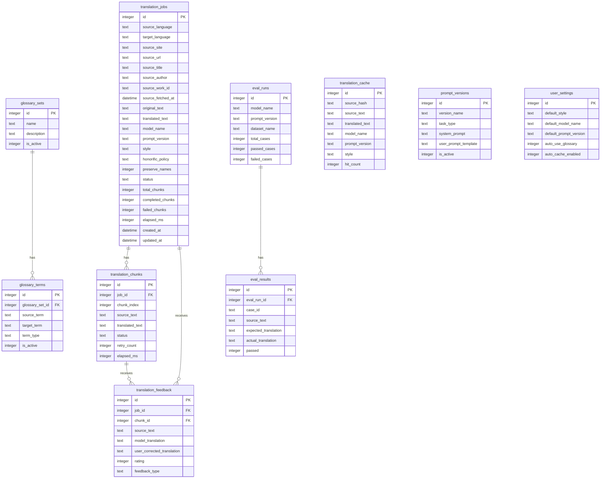

# DB

## 1. 개요

이 문서는 `qwen3:14b` 모델을 사용한 일본어 → 한국어 웹소설 번역 사이트의 데이터베이스 구조를 정의한다.

이 프로젝트는 다음 두 가지 방식으로 원문을 입력받는다.

```text
1. 사용자가 일본어 원문을 직접 입력
2. 사용자가 pixiv 소설 URL을 입력하여 원문 수집
```

DB는 단순 번역 결과 저장소가 아니라, 다음 기능을 지원하기 위한 핵심 저장소이다.

```text
번역 작업 이력 저장
pixiv 원문 출처 정보 저장
긴 텍스트 chunk 단위 번역 상태 관리
용어집 관리
중복 번역 캐싱
사용자 수정/피드백 저장
프롬프트 버전 추적
하네스 평가 결과 저장
번역 품질 개선 데이터 축적
```

초기 개발 단계에서는 `SQLite`를 사용한다.

---

## 2. DB 선택 기준

## 2.1 MVP 단계

추천 DB:

```text
SQLite
```

이유:

```text
설치가 간단함
로컬 개발에 적합함
개인 번역 사이트 또는 내부 도구에 충분함
FastAPI와 쉽게 연동 가능함
파일 하나로 백업 가능함
```

기본 DB 파일:

```text
backend/translation.db
```

---

## 2.2 운영 확장 단계

추천 DB:

```text
PostgreSQL
```

이유:

```text
다중 사용자 처리에 적합함
동시 요청 처리에 강함
검색, 인덱스, 트랜잭션 기능이 안정적임
서버 배포 환경에 적합함
```

---

## 3. 전체 테이블 구성

```text
translation_jobs        번역 요청 1건 단위
translation_chunks      긴 텍스트 분할 번역 단위
glossary_sets           용어집 묶음
glossary_terms          용어집 항목
translation_cache       중복 번역 캐시
translation_feedback    사용자 수정/피드백
prompt_versions         프롬프트 버전 관리
eval_runs               하네스 평가 실행 기록
eval_results            하네스 평가 케이스별 결과
user_settings           기본 번역 설정
```

---

## 4. MVP 우선순위

초기 구현에서는 아래 4개 테이블을 먼저 만든다.

```text
1. translation_jobs
2. translation_chunks
3. glossary_terms
4. translation_cache
```

이후 기능 확장 시 다음 테이블을 추가한다.

```text
5. glossary_sets
6. translation_feedback
7. prompt_versions
8. eval_runs
9. eval_results
10. user_settings
```

---

## 5. ERD 개요



---

# 6. 테이블 상세 설계

---

## 6.1 translation_jobs

번역 요청 1건을 저장하는 테이블이다.

사용자가 직접 원문을 입력하거나 pixiv URL에서 원문을 가져오면 `translation_jobs`에 작업 1건이 생성된다.

긴 텍스트는 내부적으로 여러 chunk로 나뉘며, 각 chunk는 `translation_chunks`에 저장된다.

---

### 6.1.1 용도

```text
번역 작업 상태 관리
전체 원문 저장
전체 번역 결과 저장
pixiv 원문 출처 정보 저장
모델명, 프롬프트 버전, 번역 스타일 추적
작업 성공/실패 여부 추적
```

---

### 6.1.2 source metadata 정책

pixiv 수집 기능 추가로 `translation_jobs`는 원문 출처 정보를 함께 저장한다.

source metadata:

```text
source_site
source_url
source_title
source_author
source_work_id
source_fetched_at
```

컬럼 설명:

| 컬럼명                | 타입     | 설명                                                 |
| --------------------- | -------- | ---------------------------------------------------- |
| `source_site`       | TEXT     | 원문 출처. 직접 입력은 `manual`, pixiv는 `pixiv` |
| `source_url`        | TEXT     | 원문을 가져온 URL                                    |
| `source_title`      | TEXT     | pixiv 작품 제목                                      |
| `source_author`     | TEXT     | pixiv 작가명                                         |
| `source_work_id`    | TEXT     | pixiv novel ID                                       |
| `source_fetched_at` | DATETIME | pixiv에서 원문을 수집한 시각                         |

---

### 6.1.3 source_site 값

MVP 단계에서는 다음 값만 허용한다.

```text
manual    사용자가 직접 원문 입력
pixiv     pixiv URL에서 원문 수집
```

향후 다른 사이트를 추가할 경우 다음처럼 확장할 수 있다.

```text
syosetu
kakuyomu
note
```

---

### 6.1.4 DDL

```sql
CREATE TABLE IF NOT EXISTS translation_jobs (
    id INTEGER PRIMARY KEY AUTOINCREMENT,

    source_language TEXT NOT NULL DEFAULT 'ja',
    target_language TEXT NOT NULL DEFAULT 'ko',

    -- 원문 출처 정보
    source_site TEXT NOT NULL DEFAULT 'manual'
        CHECK (source_site IN ('manual', 'pixiv')),

    source_url TEXT,
    source_title TEXT,
    source_author TEXT,
    source_work_id TEXT,
    source_fetched_at DATETIME,

    -- 원문 / 번역문
    original_text TEXT NOT NULL,
    translated_text TEXT,

    -- 모델 / 프롬프트 정보
    model_name TEXT NOT NULL DEFAULT 'qwen3:14b',
    prompt_version TEXT NOT NULL DEFAULT 'translate_v1',

    -- 번역 옵션
    style TEXT NOT NULL DEFAULT 'webnovel',
    honorific_policy TEXT NOT NULL DEFAULT 'preserve',
    preserve_names INTEGER NOT NULL DEFAULT 1,

    -- 작업 상태
    status TEXT NOT NULL DEFAULT 'pending'
        CHECK (status IN ('pending', 'running', 'completed', 'failed', 'cancelled')),

    total_chunks INTEGER NOT NULL DEFAULT 0,
    completed_chunks INTEGER NOT NULL DEFAULT 0,
    failed_chunks INTEGER NOT NULL DEFAULT 0,

    error_message TEXT,

    elapsed_ms INTEGER,

    created_at DATETIME NOT NULL DEFAULT CURRENT_TIMESTAMP,
    updated_at DATETIME NOT NULL DEFAULT CURRENT_TIMESTAMP
);
```

---

### 6.1.5 status 값

```text
pending      대기
running      번역 중
completed    완료
failed       실패
cancelled    취소
```

---

### 6.1.6 직접 입력 번역 저장 예시

직접 입력의 경우 `source_site`는 `manual`이다.

```text
source_site: manual
source_url: NULL
source_title: NULL
source_author: NULL
source_work_id: NULL
source_fetched_at: NULL
```

```sql
INSERT INTO translation_jobs (
    source_site,
    original_text,
    model_name,
    prompt_version,
    style,
    status
)
VALUES (
    'manual',
    '彼は静かに笑った。',
    'qwen3:14b',
    'translate_v1',
    'webnovel',
    'pending'
);
```

---

### 6.1.7 pixiv URL 기반 번역 저장 예시

pixiv에서 원문을 수집한 경우 source metadata를 함께 저장한다.

```text
source_site: pixiv
source_url: https://www.pixiv.net/novel/show.php?id=12345678
source_title: 作品タイトル
source_author: 作者名
source_work_id: 12345678
source_fetched_at: 2026-06-22 10:00:00
```

```sql
INSERT INTO translation_jobs (
    source_site,
    source_url,
    source_title,
    source_author,
    source_work_id,
    source_fetched_at,
    original_text,
    model_name,
    prompt_version,
    style,
    status
)
VALUES (
    'pixiv',
    'https://www.pixiv.net/novel/show.php?id=12345678',
    '作品タイトル',
    '作者名',
    '12345678',
    CURRENT_TIMESTAMP,
    '小説本文...',
    'qwen3:14b',
    'translate_v1',
    'webnovel',
    'pending'
);
```

---

## 6.2 translation_chunks

긴 텍스트를 나눠 번역한 chunk 단위 결과를 저장한다.

예를 들어 소설 1화가 너무 길면 다음처럼 저장한다.

```text
translation_jobs 1건
 ├─ translation_chunks 0
 ├─ translation_chunks 1
 ├─ translation_chunks 2
 └─ translation_chunks 3
```

---

### 6.2.1 용도

```text
chunk 단위 번역 결과 저장
실패한 chunk만 재시도
chunk별 응답 시간 측정
chunk별 raw response 저장
긴 텍스트 번역 안정성 확보
```

---

### 6.2.2 DDL

```sql
CREATE TABLE IF NOT EXISTS translation_chunks (
    id INTEGER PRIMARY KEY AUTOINCREMENT,

    job_id INTEGER NOT NULL,
    chunk_index INTEGER NOT NULL,

    source_text TEXT NOT NULL,
    translated_text TEXT,

    context_before TEXT,
    context_after TEXT,

    status TEXT NOT NULL DEFAULT 'pending'
        CHECK (status IN ('pending', 'running', 'completed', 'failed', 'skipped')),

    retry_count INTEGER NOT NULL DEFAULT 0,

    prompt_used TEXT,
    raw_model_response TEXT,

    elapsed_ms INTEGER,
    error_message TEXT,

    created_at DATETIME NOT NULL DEFAULT CURRENT_TIMESTAMP,
    updated_at DATETIME NOT NULL DEFAULT CURRENT_TIMESTAMP,

    FOREIGN KEY (job_id) REFERENCES translation_jobs(id) ON DELETE CASCADE,

    UNIQUE (job_id, chunk_index)
);
```

---

### 6.2.3 주요 설계 포인트

```text
UNIQUE (job_id, chunk_index)를 사용한다.
하나의 번역 작업 안에서 chunk 순서가 중복되지 않도록 한다.
chunk 실패 시 전체 작업을 다시 실행하지 않고 해당 chunk만 재시도한다.
```

---

## 6.3 glossary_sets

용어집 묶음을 저장한다.

작품별, 장르별, 사용자별 용어집을 나누고 싶을 때 사용한다.

---

### 6.3.1 예시

```text
판타지 기본 용어집
로맨스 기본 용어집
작품 A 전용 용어집
작품 B 전용 용어집
```

---

### 6.3.2 DDL

```sql
CREATE TABLE IF NOT EXISTS glossary_sets (
    id INTEGER PRIMARY KEY AUTOINCREMENT,

    name TEXT NOT NULL,
    description TEXT,

    is_active INTEGER NOT NULL DEFAULT 1,

    created_at DATETIME NOT NULL DEFAULT CURRENT_TIMESTAMP,
    updated_at DATETIME NOT NULL DEFAULT CURRENT_TIMESTAMP,

    UNIQUE (name)
);
```

---

## 6.4 glossary_terms

실제 용어집 항목을 저장한다.

일본어 원문에 특정 단어가 나오면 지정한 한국어 번역어를 사용하도록 강제하거나 권장할 수 있다.

---

### 6.4.1 예시

```text
魔王 → 마왕
勇者 → 용사
王都 → 왕도
姫様 → 공주님
お兄ちゃん → 오빠
```

---

### 6.4.2 DDL

```sql
CREATE TABLE IF NOT EXISTS glossary_terms (
    id INTEGER PRIMARY KEY AUTOINCREMENT,

    glossary_set_id INTEGER,

    source_term TEXT NOT NULL,
    target_term TEXT NOT NULL,

    term_type TEXT NOT NULL DEFAULT 'common',
    description TEXT,

    is_case_sensitive INTEGER NOT NULL DEFAULT 0,
    is_active INTEGER NOT NULL DEFAULT 1,

    created_at DATETIME NOT NULL DEFAULT CURRENT_TIMESTAMP,
    updated_at DATETIME NOT NULL DEFAULT CURRENT_TIMESTAMP,

    FOREIGN KEY (glossary_set_id) REFERENCES glossary_sets(id) ON DELETE CASCADE,

    UNIQUE (glossary_set_id, source_term)
);
```

---

### 6.4.3 term_type 예시

```text
common        일반 용어
person        인명
place         지명
title         직함
skill         기술명
organization  조직명
honorific     호칭
```

---

### 6.4.4 예시 INSERT

```sql
INSERT INTO glossary_sets (name, description)
VALUES ('fantasy_default', '판타지 소설 기본 용어집');

INSERT INTO glossary_terms
(glossary_set_id, source_term, target_term, term_type, description)
VALUES
(1, '魔王', '마왕', 'title', '판타지 직함'),
(1, '勇者', '용사', 'title', '판타지 직함'),
(1, '王都', '왕도', 'place', '수도보다 판타지 문체에 적합'),
(1, '姫様', '공주님', 'honorific', '존칭 유지');
```

---

## 6.5 translation_cache

같은 입력을 반복 번역하지 않기 위한 캐시 테이블이다.

로컬 LLM은 응답 시간이 오래 걸릴 수 있으므로 캐시가 있으면 체감 속도가 좋아진다.

---

### 6.5.1 용도

```text
중복 번역 방지
모델 호출 비용 감소
응답 속도 개선
동일 조건 번역 재사용
```

---

### 6.5.2 DDL

```sql
CREATE TABLE IF NOT EXISTS translation_cache (
    id INTEGER PRIMARY KEY AUTOINCREMENT,

    source_hash TEXT NOT NULL UNIQUE,

    source_text TEXT NOT NULL,
    translated_text TEXT NOT NULL,

    model_name TEXT NOT NULL,
    prompt_version TEXT NOT NULL,
    style TEXT NOT NULL,
    honorific_policy TEXT NOT NULL DEFAULT 'preserve',
    preserve_names INTEGER NOT NULL DEFAULT 1,

    glossary_hash TEXT,

    hit_count INTEGER NOT NULL DEFAULT 0,

    created_at DATETIME NOT NULL DEFAULT CURRENT_TIMESTAMP,
    updated_at DATETIME NOT NULL DEFAULT CURRENT_TIMESTAMP
);
```

---

### 6.5.3 source_hash 생성 기준

캐시는 원문만 같다고 재사용하면 안 된다.

다음 값이 모두 같을 때만 같은 캐시로 본다.

```text
source_text
model_name
prompt_version
style
honorific_policy
preserve_names
glossary_hash
```

---

### 6.5.4 Python 예시

```python
import hashlib

def make_translation_cache_key(
    source_text: str,
    model_name: str,
    prompt_version: str,
    style: str,
    honorific_policy: str,
    preserve_names: bool,
    glossary_hash: str | None = None,
) -> str:
    raw = "|".join([
        source_text,
        model_name,
        prompt_version,
        style,
        honorific_policy,
        str(preserve_names),
        glossary_hash or "",
    ])

    return hashlib.sha256(raw.encode("utf-8")).hexdigest()
```

---

### 6.5.5 pixiv URL과 캐시의 관계

`translation_cache`는 원문과 번역 조건 기준으로 동작한다.

따라서 pixiv URL 자체는 cache key의 필수 요소가 아니다.

기본 cache key는 기존 정책을 유지한다.

```text
source_text
model_name
prompt_version
style
honorific_policy
preserve_names
glossary_hash
```

동일 pixiv URL에서 원문을 다시 가져오는 요청이 많은 경우, 추후 별도 fetch cache 테이블을 추가할 수 있다.

추후 확장 후보:

```text
source_fetch_cache
```

MVP 단계에서는 별도 `source_fetch_cache` 테이블을 만들지 않는다.
대신 `translation_jobs.source_url`과 `translation_jobs.source_work_id`로 이력을 추적한다.

---

## 6.6 translation_feedback

사용자가 모델 번역 결과를 수정하거나 평가한 내용을 저장한다.

이 테이블은 번역 품질 개선에 중요하다.

---

### 6.6.1 용도

```text
사용자 수정 번역 저장
오역 유형 분류
용어집 개선 데이터 확보
프롬프트 개선 근거 확보
golden dataset 후보 생성
```

---

### 6.6.2 DDL

```sql
CREATE TABLE IF NOT EXISTS translation_feedback (
    id INTEGER PRIMARY KEY AUTOINCREMENT,

    job_id INTEGER,
    chunk_id INTEGER,

    source_text TEXT NOT NULL,
    model_translation TEXT NOT NULL,
    user_corrected_translation TEXT,

    rating INTEGER CHECK (rating BETWEEN 1 AND 5),

    feedback_type TEXT,
    comment TEXT,

    created_at DATETIME NOT NULL DEFAULT CURRENT_TIMESTAMP,

    FOREIGN KEY (job_id) REFERENCES translation_jobs(id) ON DELETE SET NULL,
    FOREIGN KEY (chunk_id) REFERENCES translation_chunks(id) ON DELETE SET NULL
);
```

---

### 6.6.3 feedback_type 예시

```text
wrong_meaning        의미 오역
awkward_korean       한국어 어색함
glossary_violation   용어집 위반
tone_mismatch        말투 불일치
missing_sentence     문장 누락
too_literal          지나친 직역
too_free             지나친 의역
name_changed         고유명사 변경
japanese_left        일본어 잔존
```

---

## 6.7 prompt_versions

프롬프트 버전을 관리한다.

프롬프트가 바뀌면 번역 품질이 달라질 수 있으므로, 어떤 번역 결과가 어떤 프롬프트로 생성되었는지 추적해야 한다.

---

### 6.7.1 용도

```text
프롬프트 버전 관리
번역 결과 재현성 확보
하네스 평가와 연결
프롬프트 변경 이력 관리
```

---

### 6.7.2 DDL

```sql
CREATE TABLE IF NOT EXISTS prompt_versions (
    id INTEGER PRIMARY KEY AUTOINCREMENT,

    version_name TEXT NOT NULL UNIQUE,
    task_type TEXT NOT NULL DEFAULT 'translation',

    system_prompt TEXT NOT NULL,
    user_prompt_template TEXT NOT NULL,

    description TEXT,
    is_active INTEGER NOT NULL DEFAULT 0,

    created_at DATETIME NOT NULL DEFAULT CURRENT_TIMESTAMP
);
```

---

### 6.7.3 예시

```text
translate_v1    기본 일본어 → 한국어 번역
translate_v2    웹소설 문체 강화
translate_v3    대사체 보존 강화
translate_v4    용어집 준수 강화
```

---

## 6.8 eval_runs

하네스 평가 실행 1회를 저장한다.

프롬프트나 chunking 전략을 바꿨을 때 평가 결과를 비교할 수 있다.

---

### 6.8.1 용도

```text
평가 실행 단위 저장
모델/프롬프트별 성능 비교
평균 응답 시간 추적
품질 점수 추적
```

---

### 6.8.2 DDL

```sql
CREATE TABLE IF NOT EXISTS eval_runs (
    id INTEGER PRIMARY KEY AUTOINCREMENT,

    run_name TEXT,

    model_name TEXT NOT NULL,
    prompt_version TEXT NOT NULL,
    dataset_name TEXT NOT NULL,

    total_cases INTEGER NOT NULL DEFAULT 0,
    passed_cases INTEGER NOT NULL DEFAULT 0,
    failed_cases INTEGER NOT NULL DEFAULT 0,

    avg_elapsed_ms INTEGER,

    no_japanese_left_score REAL,
    paragraph_match_score REAL,
    glossary_preserve_score REAL,
    dialogue_style_score REAL,
    no_empty_translation_score REAL,

    report_json TEXT,

    created_at DATETIME NOT NULL DEFAULT CURRENT_TIMESTAMP
);
```

---

## 6.9 eval_results

하네스 평가 케이스별 결과를 저장한다.

---

### 6.9.1 용도

```text
실패 케이스 추적
어떤 원문에서 품질 문제가 발생했는지 확인
프롬프트 수정 전후 결과 비교
regression test 관리
```

---

### 6.9.2 DDL

```sql
CREATE TABLE IF NOT EXISTS eval_results (
    id INTEGER PRIMARY KEY AUTOINCREMENT,

    eval_run_id INTEGER NOT NULL,

    case_id TEXT NOT NULL,
    source_text TEXT NOT NULL,
    expected_translation TEXT,
    actual_translation TEXT,

    passed INTEGER NOT NULL DEFAULT 0,
    score REAL,

    fail_reason TEXT,
    elapsed_ms INTEGER,

    created_at DATETIME NOT NULL DEFAULT CURRENT_TIMESTAMP,

    FOREIGN KEY (eval_run_id) REFERENCES eval_runs(id) ON DELETE CASCADE
);
```

---

## 6.10 user_settings

사용자의 기본 번역 설정을 저장한다.

사용자 계정을 만들지 않는 로컬 앱이라면 단일 row만 사용해도 된다.

---

### 6.10.1 용도

```text
기본 번역 스타일 저장
기본 모델 저장
기본 프롬프트 버전 저장
용어집 자동 적용 여부 저장
캐시 사용 여부 저장
```

---

### 6.10.2 DDL

```sql
CREATE TABLE IF NOT EXISTS user_settings (
    id INTEGER PRIMARY KEY AUTOINCREMENT,

    default_style TEXT NOT NULL DEFAULT 'webnovel',
    default_honorific_policy TEXT NOT NULL DEFAULT 'preserve',
    default_preserve_names INTEGER NOT NULL DEFAULT 1,

    default_model_name TEXT NOT NULL DEFAULT 'qwen3:14b',
    default_prompt_version TEXT NOT NULL DEFAULT 'translate_v1',

    auto_use_glossary INTEGER NOT NULL DEFAULT 1,
    auto_cache_enabled INTEGER NOT NULL DEFAULT 1,

    created_at DATETIME NOT NULL DEFAULT CURRENT_TIMESTAMP,
    updated_at DATETIME NOT NULL DEFAULT CURRENT_TIMESTAMP
);
```

---

# 7. 인덱스 설계

조회 성능을 위해 다음 인덱스를 추가한다.

```sql
CREATE INDEX IF NOT EXISTS idx_translation_jobs_status
ON translation_jobs(status);

CREATE INDEX IF NOT EXISTS idx_translation_jobs_created_at
ON translation_jobs(created_at);

CREATE INDEX IF NOT EXISTS idx_translation_jobs_model_prompt
ON translation_jobs(model_name, prompt_version);

CREATE INDEX IF NOT EXISTS idx_translation_jobs_source_site
ON translation_jobs(source_site);

CREATE INDEX IF NOT EXISTS idx_translation_jobs_source_work_id
ON translation_jobs(source_work_id);

CREATE INDEX IF NOT EXISTS idx_translation_jobs_source_url
ON translation_jobs(source_url);

CREATE INDEX IF NOT EXISTS idx_translation_jobs_source_site_work_id
ON translation_jobs(source_site, source_work_id);

CREATE INDEX IF NOT EXISTS idx_translation_chunks_job_id
ON translation_chunks(job_id);

CREATE INDEX IF NOT EXISTS idx_translation_chunks_status
ON translation_chunks(status);

CREATE INDEX IF NOT EXISTS idx_glossary_terms_source_term
ON glossary_terms(source_term);

CREATE INDEX IF NOT EXISTS idx_glossary_terms_active
ON glossary_terms(is_active);

CREATE INDEX IF NOT EXISTS idx_translation_cache_source_hash
ON translation_cache(source_hash);

CREATE INDEX IF NOT EXISTS idx_translation_feedback_type
ON translation_feedback(feedback_type);

CREATE INDEX IF NOT EXISTS idx_eval_runs_prompt_version
ON eval_runs(prompt_version);

CREATE INDEX IF NOT EXISTS idx_eval_results_eval_run_id
ON eval_results(eval_run_id);
```

---

## 7.1 source metadata 인덱스 목적

| 인덱스                                       | 목적                             |
| -------------------------------------------- | -------------------------------- |
| `idx_translation_jobs_source_site`         | 직접 입력 / pixiv 작업 구분 조회 |
| `idx_translation_jobs_source_work_id`      | pixiv novel ID 기준 조회         |
| `idx_translation_jobs_source_url`          | 동일 URL 재요청 확인             |
| `idx_translation_jobs_source_site_work_id` | pixiv 작품 단위 이력 조회        |

---

# 8. updated_at 자동 갱신 트리거

SQLite에서는 `updated_at`을 자동 갱신하려면 트리거를 사용한다.

```sql
CREATE TRIGGER IF NOT EXISTS trg_translation_jobs_updated_at
AFTER UPDATE ON translation_jobs
FOR EACH ROW
BEGIN
    UPDATE translation_jobs
    SET updated_at = CURRENT_TIMESTAMP
    WHERE id = OLD.id;
END;
```

```sql
CREATE TRIGGER IF NOT EXISTS trg_translation_chunks_updated_at
AFTER UPDATE ON translation_chunks
FOR EACH ROW
BEGIN
    UPDATE translation_chunks
    SET updated_at = CURRENT_TIMESTAMP
    WHERE id = OLD.id;
END;
```

```sql
CREATE TRIGGER IF NOT EXISTS trg_glossary_sets_updated_at
AFTER UPDATE ON glossary_sets
FOR EACH ROW
BEGIN
    UPDATE glossary_sets
    SET updated_at = CURRENT_TIMESTAMP
    WHERE id = OLD.id;
END;
```

```sql
CREATE TRIGGER IF NOT EXISTS trg_glossary_terms_updated_at
AFTER UPDATE ON glossary_terms
FOR EACH ROW
BEGIN
    UPDATE glossary_terms
    SET updated_at = CURRENT_TIMESTAMP
    WHERE id = OLD.id;
END;
```

```sql
CREATE TRIGGER IF NOT EXISTS trg_translation_cache_updated_at
AFTER UPDATE ON translation_cache
FOR EACH ROW
BEGIN
    UPDATE translation_cache
    SET updated_at = CURRENT_TIMESTAMP
    WHERE id = OLD.id;
END;
```

```sql
CREATE TRIGGER IF NOT EXISTS trg_user_settings_updated_at
AFTER UPDATE ON user_settings
FOR EACH ROW
BEGIN
    UPDATE user_settings
    SET updated_at = CURRENT_TIMESTAMP
    WHERE id = OLD.id;
END;
```

---

# 9. SQLite 전체 초기화 SQL

초기 개발용 전체 SQL은 다음 파일로 관리한다.

```text
backend/app/db/schema.sql
```

실행 예시:

```bash
sqlite3 backend/translation.db < backend/app/db/schema.sql
```

---

## 9.1 전체 schema.sql 예시

```sql
PRAGMA foreign_keys = ON;

CREATE TABLE IF NOT EXISTS translation_jobs (
    id INTEGER PRIMARY KEY AUTOINCREMENT,

    source_language TEXT NOT NULL DEFAULT 'ja',
    target_language TEXT NOT NULL DEFAULT 'ko',

    source_site TEXT NOT NULL DEFAULT 'manual'
        CHECK (source_site IN ('manual', 'pixiv')),

    source_url TEXT,
    source_title TEXT,
    source_author TEXT,
    source_work_id TEXT,
    source_fetched_at DATETIME,

    original_text TEXT NOT NULL,
    translated_text TEXT,

    model_name TEXT NOT NULL DEFAULT 'qwen3:14b',
    prompt_version TEXT NOT NULL DEFAULT 'translate_v1',

    style TEXT NOT NULL DEFAULT 'webnovel',
    honorific_policy TEXT NOT NULL DEFAULT 'preserve',
    preserve_names INTEGER NOT NULL DEFAULT 1,

    status TEXT NOT NULL DEFAULT 'pending'
        CHECK (status IN ('pending', 'running', 'completed', 'failed', 'cancelled')),

    total_chunks INTEGER NOT NULL DEFAULT 0,
    completed_chunks INTEGER NOT NULL DEFAULT 0,
    failed_chunks INTEGER NOT NULL DEFAULT 0,

    error_message TEXT,
    elapsed_ms INTEGER,

    created_at DATETIME NOT NULL DEFAULT CURRENT_TIMESTAMP,
    updated_at DATETIME NOT NULL DEFAULT CURRENT_TIMESTAMP
);

CREATE TABLE IF NOT EXISTS translation_chunks (
    id INTEGER PRIMARY KEY AUTOINCREMENT,

    job_id INTEGER NOT NULL,
    chunk_index INTEGER NOT NULL,

    source_text TEXT NOT NULL,
    translated_text TEXT,

    context_before TEXT,
    context_after TEXT,

    status TEXT NOT NULL DEFAULT 'pending'
        CHECK (status IN ('pending', 'running', 'completed', 'failed', 'skipped')),

    retry_count INTEGER NOT NULL DEFAULT 0,

    prompt_used TEXT,
    raw_model_response TEXT,

    elapsed_ms INTEGER,
    error_message TEXT,

    created_at DATETIME NOT NULL DEFAULT CURRENT_TIMESTAMP,
    updated_at DATETIME NOT NULL DEFAULT CURRENT_TIMESTAMP,

    FOREIGN KEY (job_id) REFERENCES translation_jobs(id) ON DELETE CASCADE,

    UNIQUE (job_id, chunk_index)
);

CREATE TABLE IF NOT EXISTS glossary_sets (
    id INTEGER PRIMARY KEY AUTOINCREMENT,

    name TEXT NOT NULL,
    description TEXT,

    is_active INTEGER NOT NULL DEFAULT 1,

    created_at DATETIME NOT NULL DEFAULT CURRENT_TIMESTAMP,
    updated_at DATETIME NOT NULL DEFAULT CURRENT_TIMESTAMP,

    UNIQUE (name)
);

CREATE TABLE IF NOT EXISTS glossary_terms (
    id INTEGER PRIMARY KEY AUTOINCREMENT,

    glossary_set_id INTEGER,

    source_term TEXT NOT NULL,
    target_term TEXT NOT NULL,

    term_type TEXT NOT NULL DEFAULT 'common',
    description TEXT,

    is_case_sensitive INTEGER NOT NULL DEFAULT 0,
    is_active INTEGER NOT NULL DEFAULT 1,

    created_at DATETIME NOT NULL DEFAULT CURRENT_TIMESTAMP,
    updated_at DATETIME NOT NULL DEFAULT CURRENT_TIMESTAMP,

    FOREIGN KEY (glossary_set_id) REFERENCES glossary_sets(id) ON DELETE CASCADE,

    UNIQUE (glossary_set_id, source_term)
);

CREATE TABLE IF NOT EXISTS translation_cache (
    id INTEGER PRIMARY KEY AUTOINCREMENT,

    source_hash TEXT NOT NULL UNIQUE,

    source_text TEXT NOT NULL,
    translated_text TEXT NOT NULL,

    model_name TEXT NOT NULL,
    prompt_version TEXT NOT NULL,
    style TEXT NOT NULL,
    honorific_policy TEXT NOT NULL DEFAULT 'preserve',
    preserve_names INTEGER NOT NULL DEFAULT 1,

    glossary_hash TEXT,

    hit_count INTEGER NOT NULL DEFAULT 0,

    created_at DATETIME NOT NULL DEFAULT CURRENT_TIMESTAMP,
    updated_at DATETIME NOT NULL DEFAULT CURRENT_TIMESTAMP
);

CREATE TABLE IF NOT EXISTS translation_feedback (
    id INTEGER PRIMARY KEY AUTOINCREMENT,

    job_id INTEGER,
    chunk_id INTEGER,

    source_text TEXT NOT NULL,
    model_translation TEXT NOT NULL,
    user_corrected_translation TEXT,

    rating INTEGER CHECK (rating BETWEEN 1 AND 5),

    feedback_type TEXT,
    comment TEXT,

    created_at DATETIME NOT NULL DEFAULT CURRENT_TIMESTAMP,

    FOREIGN KEY (job_id) REFERENCES translation_jobs(id) ON DELETE SET NULL,
    FOREIGN KEY (chunk_id) REFERENCES translation_chunks(id) ON DELETE SET NULL
);

CREATE TABLE IF NOT EXISTS prompt_versions (
    id INTEGER PRIMARY KEY AUTOINCREMENT,

    version_name TEXT NOT NULL UNIQUE,
    task_type TEXT NOT NULL DEFAULT 'translation',

    system_prompt TEXT NOT NULL,
    user_prompt_template TEXT NOT NULL,

    description TEXT,
    is_active INTEGER NOT NULL DEFAULT 0,

    created_at DATETIME NOT NULL DEFAULT CURRENT_TIMESTAMP
);

CREATE TABLE IF NOT EXISTS eval_runs (
    id INTEGER PRIMARY KEY AUTOINCREMENT,

    run_name TEXT,

    model_name TEXT NOT NULL,
    prompt_version TEXT NOT NULL,
    dataset_name TEXT NOT NULL,

    total_cases INTEGER NOT NULL DEFAULT 0,
    passed_cases INTEGER NOT NULL DEFAULT 0,
    failed_cases INTEGER NOT NULL DEFAULT 0,

    avg_elapsed_ms INTEGER,

    no_japanese_left_score REAL,
    paragraph_match_score REAL,
    glossary_preserve_score REAL,
    dialogue_style_score REAL,
    no_empty_translation_score REAL,

    report_json TEXT,

    created_at DATETIME NOT NULL DEFAULT CURRENT_TIMESTAMP
);

CREATE TABLE IF NOT EXISTS eval_results (
    id INTEGER PRIMARY KEY AUTOINCREMENT,

    eval_run_id INTEGER NOT NULL,

    case_id TEXT NOT NULL,
    source_text TEXT NOT NULL,
    expected_translation TEXT,
    actual_translation TEXT,

    passed INTEGER NOT NULL DEFAULT 0,
    score REAL,

    fail_reason TEXT,
    elapsed_ms INTEGER,

    created_at DATETIME NOT NULL DEFAULT CURRENT_TIMESTAMP,

    FOREIGN KEY (eval_run_id) REFERENCES eval_runs(id) ON DELETE CASCADE
);

CREATE TABLE IF NOT EXISTS user_settings (
    id INTEGER PRIMARY KEY AUTOINCREMENT,

    default_style TEXT NOT NULL DEFAULT 'webnovel',
    default_honorific_policy TEXT NOT NULL DEFAULT 'preserve',
    default_preserve_names INTEGER NOT NULL DEFAULT 1,

    default_model_name TEXT NOT NULL DEFAULT 'qwen3:14b',
    default_prompt_version TEXT NOT NULL DEFAULT 'translate_v1',

    auto_use_glossary INTEGER NOT NULL DEFAULT 1,
    auto_cache_enabled INTEGER NOT NULL DEFAULT 1,

    created_at DATETIME NOT NULL DEFAULT CURRENT_TIMESTAMP,
    updated_at DATETIME NOT NULL DEFAULT CURRENT_TIMESTAMP
);

CREATE INDEX IF NOT EXISTS idx_translation_jobs_status
ON translation_jobs(status);

CREATE INDEX IF NOT EXISTS idx_translation_jobs_created_at
ON translation_jobs(created_at);

CREATE INDEX IF NOT EXISTS idx_translation_jobs_model_prompt
ON translation_jobs(model_name, prompt_version);

CREATE INDEX IF NOT EXISTS idx_translation_jobs_source_site
ON translation_jobs(source_site);

CREATE INDEX IF NOT EXISTS idx_translation_jobs_source_work_id
ON translation_jobs(source_work_id);

CREATE INDEX IF NOT EXISTS idx_translation_jobs_source_url
ON translation_jobs(source_url);

CREATE INDEX IF NOT EXISTS idx_translation_jobs_source_site_work_id
ON translation_jobs(source_site, source_work_id);

CREATE INDEX IF NOT EXISTS idx_translation_chunks_job_id
ON translation_chunks(job_id);

CREATE INDEX IF NOT EXISTS idx_translation_chunks_status
ON translation_chunks(status);

CREATE INDEX IF NOT EXISTS idx_glossary_terms_source_term
ON glossary_terms(source_term);

CREATE INDEX IF NOT EXISTS idx_glossary_terms_active
ON glossary_terms(is_active);

CREATE INDEX IF NOT EXISTS idx_translation_cache_source_hash
ON translation_cache(source_hash);

CREATE INDEX IF NOT EXISTS idx_translation_feedback_type
ON translation_feedback(feedback_type);

CREATE INDEX IF NOT EXISTS idx_eval_runs_prompt_version
ON eval_runs(prompt_version);

CREATE INDEX IF NOT EXISTS idx_eval_results_eval_run_id
ON eval_results(eval_run_id);

CREATE TRIGGER IF NOT EXISTS trg_translation_jobs_updated_at
AFTER UPDATE ON translation_jobs
FOR EACH ROW
BEGIN
    UPDATE translation_jobs
    SET updated_at = CURRENT_TIMESTAMP
    WHERE id = OLD.id;
END;

CREATE TRIGGER IF NOT EXISTS trg_translation_chunks_updated_at
AFTER UPDATE ON translation_chunks
FOR EACH ROW
BEGIN
    UPDATE translation_chunks
    SET updated_at = CURRENT_TIMESTAMP
    WHERE id = OLD.id;
END;

CREATE TRIGGER IF NOT EXISTS trg_glossary_sets_updated_at
AFTER UPDATE ON glossary_sets
FOR EACH ROW
BEGIN
    UPDATE glossary_sets
    SET updated_at = CURRENT_TIMESTAMP
    WHERE id = OLD.id;
END;

CREATE TRIGGER IF NOT EXISTS trg_glossary_terms_updated_at
AFTER UPDATE ON glossary_terms
FOR EACH ROW
BEGIN
    UPDATE glossary_terms
    SET updated_at = CURRENT_TIMESTAMP
    WHERE id = OLD.id;
END;

CREATE TRIGGER IF NOT EXISTS trg_translation_cache_updated_at
AFTER UPDATE ON translation_cache
FOR EACH ROW
BEGIN
    UPDATE translation_cache
    SET updated_at = CURRENT_TIMESTAMP
    WHERE id = OLD.id;
END;

CREATE TRIGGER IF NOT EXISTS trg_user_settings_updated_at
AFTER UPDATE ON user_settings
FOR EACH ROW
BEGIN
    UPDATE user_settings
    SET updated_at = CURRENT_TIMESTAMP
    WHERE id = OLD.id;
END;
```

---

# 10. 기존 DB 마이그레이션 SQL

이미 `translation_jobs` 테이블이 생성되어 있는 경우 아래 SQL로 pixiv source metadata 컬럼을 추가한다.

```sql
ALTER TABLE translation_jobs
ADD COLUMN source_site TEXT NOT NULL DEFAULT 'manual';

ALTER TABLE translation_jobs
ADD COLUMN source_url TEXT;

ALTER TABLE translation_jobs
ADD COLUMN source_title TEXT;

ALTER TABLE translation_jobs
ADD COLUMN source_author TEXT;

ALTER TABLE translation_jobs
ADD COLUMN source_work_id TEXT;

ALTER TABLE translation_jobs
ADD COLUMN source_fetched_at DATETIME;
```

인덱스도 함께 추가한다.

```sql
CREATE INDEX IF NOT EXISTS idx_translation_jobs_source_site
ON translation_jobs(source_site);

CREATE INDEX IF NOT EXISTS idx_translation_jobs_source_work_id
ON translation_jobs(source_work_id);

CREATE INDEX IF NOT EXISTS idx_translation_jobs_source_url
ON translation_jobs(source_url);

CREATE INDEX IF NOT EXISTS idx_translation_jobs_source_site_work_id
ON translation_jobs(source_site, source_work_id);
```

주의:

```text
SQLite에서는 ALTER TABLE ADD COLUMN으로 CHECK 제약을 나중에 추가하기 어렵다.
따라서 기존 DB에 마이그레이션할 때는 애플리케이션 레벨에서 source_site 값을 검증한다.
신규 DB 생성 시에는 CREATE TABLE 단계에서 CHECK 제약을 포함한다.
```

---

# 11. FastAPI 연동 시 주의사항

SQLite에서 외래키를 사용하려면 연결할 때마다 다음 옵션을 활성화해야 한다.

```sql
PRAGMA foreign_keys = ON;
```

SQLAlchemy 사용 예시:

```python
from sqlalchemy import create_engine, event

engine = create_engine(
    "sqlite:///./translation.db",
    connect_args={"check_same_thread": False},
)

@event.listens_for(engine, "connect")
def enable_sqlite_foreign_keys(dbapi_connection, connection_record):
    cursor = dbapi_connection.cursor()
    cursor.execute("PRAGMA foreign_keys=ON")
    cursor.close()
```

---

# 12. 데이터 저장 정책

## 12.1 저장해야 하는 데이터

```text
번역 원문
번역 결과
chunk별 번역 결과
pixiv source metadata
모델명
프롬프트 버전
번역 옵션
오류 메시지
응답 시간
용어집
사용자 수정 번역
하네스 평가 결과
```

---

## 12.2 저장하지 않는 것이 좋은 데이터

```text
불필요하게 긴 디버그 로그
사용자 개인정보
인증 정보
외부 API 키
pixiv 로그인 정보
pixiv 인증 쿠키
전체 request header
전체 stack trace
```

---

## 12.3 pixiv 원문 저장 정책

```text
pixiv에서 수집한 원문은 사용자의 번역 작업 생성 목적에 한해 저장한다.
pixiv 원문은 외부 API로 전송하지 않는다.
pixiv 로그인 정보나 인증 쿠키는 DB에 저장하지 않는다.
수집한 원문을 재배포하거나 공개 저장소에 포함하지 않는다.
로그에는 pixiv 원문 전체를 남기지 않는다.
source_url, source_title, source_author, source_work_id는 번역 이력 식별 목적으로 저장한다.
```

---

## 12.4 모델 응답 저장 정책

`raw_model_response`는 디버깅에 유용하지만 DB 용량이 커질 수 있다.

권장 정책:

```text
개발 환경: 저장 허용
운영 환경: 옵션으로 저장 여부 결정
```

환경 변수 예시:

```env
SAVE_RAW_MODEL_RESPONSE=true
```

---

# 13. 캐시 정책

## 13.1 캐시 사용 조건

다음 조건이 모두 같을 때 캐시를 재사용한다.

```text
원문
모델명
프롬프트 버전
번역 스타일
존댓말 정책
고유명사 보존 여부
용어집 hash
```

---

## 13.2 캐시 무효화 조건

다음 중 하나라도 바뀌면 기존 캐시는 사용하지 않는다.

```text
프롬프트 버전 변경
모델 변경
번역 스타일 변경
용어집 변경
chunking 방식 변경
```

---

## 13.3 캐시 hit_count 증가

캐시를 사용할 때마다 `hit_count`를 증가시킨다.

```sql
UPDATE translation_cache
SET hit_count = hit_count + 1,
    updated_at = CURRENT_TIMESTAMP
WHERE source_hash = :source_hash;
```

---

# 14. 번역 작업 상태 흐름

## 14.1 job 상태 흐름

정상 완료:

```text
pending
  ↓
running
  ↓
completed
```

실패:

```text
pending
  ↓
running
  ↓
failed
```

취소:

```text
pending 또는 running
  ↓
cancelled
```

---

## 14.2 chunk 상태 흐름

정상 완료:

```text
pending
  ↓
running
  ↓
completed
```

실패 후 재시도:

```text
pending
  ↓
running
  ↓
failed
  ↓
running
  ↓
completed
```

---

# 15. 번역 이력 조회 응답 예시

## 15.1 pixiv 번역 이력

```json
{
  "job_id": 1,
  "source_site": "pixiv",
  "source_url": "https://www.pixiv.net/novel/show.php?id=12345678",
  "source_title": "作品タイトル",
  "source_author": "作者名",
  "source_work_id": "12345678",
  "source_preview": "小説本文...",
  "translated_preview": "소설 본문...",
  "model_name": "qwen3:14b",
  "prompt_version": "translate_v1",
  "status": "completed",
  "created_at": "2026-06-22T10:00:00"
}
```

---

## 15.2 직접 입력 번역 이력

```json
{
  "job_id": 2,
  "source_site": "manual",
  "source_url": null,
  "source_title": null,
  "source_author": null,
  "source_work_id": null,
  "source_preview": "彼は静かに笑った。",
  "translated_preview": "그는 조용히 웃었다.",
  "model_name": "qwen3:14b",
  "prompt_version": "translate_v1",
  "status": "completed",
  "created_at": "2026-06-22T10:05:00"
}
```

---

# 16. 하네스 평가 데이터 흐름

```text
golden_ja_ko.jsonl
  ↓
harness 실행
  ↓
qwen3:14b 번역
  ↓
rule-based evaluator
  ↓
eval_runs 저장
  ↓
eval_results 저장
  ↓
report_json 생성
```

---

## 16.1 하네스 평가 기준

기본 평가 항목:

```text
일본어 잔존 여부
문단 수 유지 여부
대사 따옴표 유지 여부
고유명사 보존 여부
용어집 준수 여부
번역 누락 여부
과도한 요약 여부
말투 일관성
존댓말/반말 보존
응답 시간
```

권장 통과 기준:

```text
no_japanese_left_score >= 0.98
paragraph_match_score >= 0.95
glossary_preserve_score >= 0.95
dialogue_style_score >= 0.90
no_empty_translation_score = 1.00
```

---

# 17. 백업 정책

SQLite 사용 시 DB 파일을 주기적으로 백업한다.

```bash
cp backend/translation.db backup/translation_$(date +%Y%m%d_%H%M%S).db
```

PostgreSQL 사용 시:

```bash
pg_dump translation_db > backup/translation_$(date +%Y%m%d_%H%M%S).sql
```

---

# 18. 마이그레이션 정책

초기에는 `schema.sql`로 관리해도 된다.

다만 테이블 변경이 많아지면 Alembic 사용을 권장한다.

```bash
alembic init migrations
alembic revision --autogenerate -m "create translation tables"
alembic upgrade head
```

마이그레이션 규칙:

```text
운영 DB 직접 수정 금지
테이블 변경 시 migration 파일 생성
컬럼 삭제보다 deprecated 처리 우선
프롬프트/하네스 관련 변경은 eval 결과와 함께 기록
source metadata 변경 시 AGENTS.md와 DB.md 동시 수정
```

---

# 19. 운영 단계 확장안

사용자 계정 기능이 필요해지면 다음 테이블을 추가한다.

```sql
CREATE TABLE IF NOT EXISTS users (
    id INTEGER PRIMARY KEY AUTOINCREMENT,

    email TEXT UNIQUE,
    username TEXT,

    created_at DATETIME NOT NULL DEFAULT CURRENT_TIMESTAMP,
    updated_at DATETIME NOT NULL DEFAULT CURRENT_TIMESTAMP
);
```

이후 기존 테이블에 `user_id`를 추가한다.

```text
translation_jobs.user_id
glossary_sets.user_id
translation_feedback.user_id
user_settings.user_id
```

운영형 구조에서는 사용자의 번역 이력과 용어집을 분리해서 관리해야 한다.

---

# 20. 최종 권장 구현 순서

## 20.1 1단계

대상 테이블:

```text
translation_jobs
translation_chunks
```

목표:

```text
직접 입력 또는 pixiv 수집 원문을 translation_jobs에 저장한다.
긴 일본어 원문을 chunk 단위로 번역하고 translation_chunks에 저장한다.
```

---

## 20.2 2단계

대상 테이블:

```text
glossary_terms
translation_cache
```

목표:

```text
용어 일관성을 유지한다.
중복 번역을 방지한다.
```

---

## 20.3 3단계

대상 테이블:

```text
glossary_sets
translation_feedback
```

목표:

```text
작품별 용어집과 사용자 수정 데이터를 관리한다.
```

---

## 20.4 4단계

대상 테이블:

```text
prompt_versions
eval_runs
eval_results
```

목표:

```text
프롬프트 변경과 번역 품질 변화를 추적한다.
```

---

## 20.5 5단계

대상 테이블:

```text
user_settings
users
```

목표:

```text
사용자별 기본 설정과 번역 이력을 관리한다.
```

---

# 21. 수정 후 확인할 파일

DB 구조를 수정한 뒤 다음 파일도 함께 확인한다.

```text
Docs/DB.md
backend/app/db/schema.sql
backend/app/db/models.py
backend/app/db/session.py
backend/app/db/repositories/translation_repository.py
backend/app/schemas/translation.py
backend/app/schemas/fetch.py
backend/app/services/fetch_service.py
AGENTS.md
```

---

# 22. 결론

이 프로젝트의 DB 구조는 다음 목적에 맞춰 설계한다.

```text
번역 작업 관리
pixiv 원문 출처 추적
긴 텍스트 chunk 처리
번역 결과 저장
용어집 관리
중복 번역 캐싱
사용자 피드백 저장
프롬프트 버전 추적
하네스 평가 결과 관리
```

초기 개발에서는 복잡한 구조보다 아래 최소 구조를 먼저 구현한다.

```text
translation_jobs
translation_chunks
glossary_terms
translation_cache
```

이번 설계에서 `translation_jobs`는 번역 작업 테이블이면서 동시에 원문 출처 추적 테이블의 역할을 한다.

직접 입력 번역:

```text
source_site = manual
source metadata는 대부분 NULL
```

pixiv URL 기반 번역:

```text
source_site = pixiv
source_url 저장
source_title 저장
source_author 저장
source_work_id 저장
source_fetched_at 저장
```
